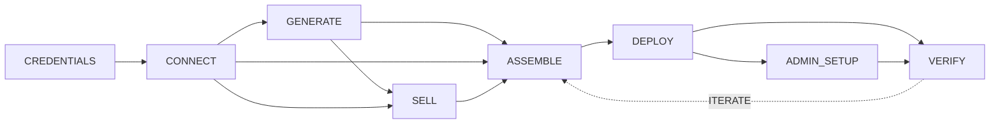

# Vibes Workflow Graph

Canonical workflow sequence for all Vibes skills. Referenced by launch (Agent Teams), test (sequential fixtures), and native skills (interactive).

---

## Visual Graph



Solid lines = hard dependencies. Dashed line = iterate loop (always includes re-deploy).

**Key constraint:** Clerk auth requires a public URL, so DEPLOY is mandatory. The iterate cycle always flows through A -> D -> V.

---

## Meta-Rule: ITERATE

ITERATE is not a formal node — it's a standing capability at any point after first deploy. The iterate cycle always includes re-deploy: edit app.jsx -> A -> D -> V. There is no "local-only" testing path — Clerk auth requires a public URL.

Context mapping:
- **launch**: Prescriptive — no open iteration. Runs G -> S -> A -> D -> AD -> V in one shot.
- **test**: Phases 7-10 implement diagnosis/fix/re-deploy cycles.
- **native skills**: AskUserQuestion "Keep improving" option triggers iterate loop.

---

## Node Registry

| ID | Node | Inputs | Outputs | Prereqs | Skip If |
|----|------|--------|---------|---------|---------|
| G | GENERATE | user prompt | app.jsx | -- | app.jsx exists (ask reuse) |
| CR | CREDENTIALS | user input | Clerk PK+SK in .env | -- | .env has valid Clerk keys |
| CO | CONNECT | Clerk PK+SK | .env with API_URL+CLOUD_URL, .connect marker | CR | .env has VITE_API_URL |
| S | SELL | app context | sell config (title, tagline, billing, features) | CO | not SaaS path |
| A | ASSEMBLE | app.jsx + .env [+ sell config] | index.html | G + CO; for SaaS: + S | -- |
| D | DEPLOY | index.html | live URL | A (always required) | -- |
| AD | ADMIN_SETUP | deployed URL + user signup | CLERK_ADMIN_USER_ID, re-assembled+re-deployed | D | admin ID cached in .env; or not SaaS |
| V | VERIFY | live URL | user confirmation | D (or AD if SaaS) | -- |

---

## Node Details

### G: GENERATE
- **Cache check:** `ls -la app.jsx 2>/dev/null || echo "NOT_FOUND"`
- **Interactive:** No (agent generates autonomously)
- **Parallel group:** Can run in parallel with CR + CO
- **Script:** Agent generates app.jsx directly (vibes SKILL.md guides generation)

### CR: CREDENTIALS
- **Cache check:** `grep -qE "^VITE_CLERK_PUBLISHABLE_KEY=pk_(test|live)_" .env 2>/dev/null && echo "CACHED" || echo "NEEDED"`
- **Interactive:** Yes (user provides Clerk keys)
- **Parallel group:** Can run in parallel with G
- **Script:** AskUserQuestion prompts in connect SKILL.md

### CO: CONNECT
- **Cache check:** `grep -qE "^VITE_API_URL=" .env 2>/dev/null && echo "CACHED" || echo "NEEDED"`
- **Interactive:** No (automated deploy after CR)
- **Parallel group:** Blocked by CR, can run in parallel with G
- **Script:** `node scripts/deploy-connect.js`

### S: SELL
- **Cache check:** N/A (always interactive when on SaaS path)
- **Interactive:** Yes (user provides app title, tagline, features, billing config)
- **Parallel group:** Can run in parallel with G + CR/CO
- **Script:** AskUserQuestion prompts in sell SKILL.md

### A: ASSEMBLE
- **Cache check:** N/A (always runs — inputs may have changed)
- **Interactive:** No
- **Parallel group:** Convergence point — blocked by G + CO (+ S if SaaS)
- **Script:** `node scripts/assemble.js app.jsx index.html` or `node scripts/assemble-sell.js app.jsx index.html [options]`

### D: DEPLOY
- **Cache check:** N/A (always runs after assembly)
- **Interactive:** No
- **Parallel group:** Blocked by A
- **Script:** `node scripts/deploy-cloudflare.js` or `node scripts/deploy-exe.js`

### AD: ADMIN_SETUP
- **Cache check:** `grep -qE "^CLERK_ADMIN_USER_ID=" .env 2>/dev/null && echo "CACHED" || echo "NEEDED"`
- **Interactive:** Yes (user signs up on deployed app, provides user ID)
- **Parallel group:** Blocked by D
- **Script:** Re-run assemble-sell.js with `--admin-ids`, then re-deploy

### V: VERIFY
- **Cache check:** N/A (always interactive)
- **Interactive:** Yes (user confirms app works in browser)
- **Parallel group:** Blocked by D (or AD if SaaS)
- **Script:** Present URL via AskUserQuestion

---

## Hard Dependencies

```
CR --> CO        Connect needs Clerk keys (always required, no local-only path)
CO --> G         Generate needs Connect configured (app requires auth + sync)
G + CO --> A     Assembly needs app.jsx + .env
G + CO + S --> A SaaS assembly needs all three
A --> D          Deploy needs index.html (always required, Clerk needs public URL)
D --> AD         Admin setup needs deployed app for signup
D|AD --> V       Verify needs live URL
V --> ITERATE --> A --> D --> V  (iterate loop always includes re-deploy)
```

---

## Context Mappings

### Context: Launch (Agent Teams)

| Node | Task | Owner | BlockedBy |
|------|------|-------|-----------|
| G | T1 | builder | -- |
| CR | T2 | lead | -- |
| CO | T3 | infra | T2 |
| S | T4 | lead | -- |
| A | T5 | lead | T1, T3, T4 |
| D | T6 | lead | T5 |
| AD | Phase 3.5 | lead | T6 |
| V | T8 | lead | T6 or AD |

Parallel lanes: T1 || T2->T3 || T4. Converge at T5.
Skip logic: If CO cached, T2+T3 complete immediately. If admin cached, AD skipped.

**NOTE:** Launch is deliberately prescriptive — it automates a fixed end-to-end pipeline. The open-ended workflow graph provides context, but launch does NOT expose iteration loops or user-choice branching. It runs G -> S -> A -> D -> AD -> V in one shot.

### Context: Test (Sequential Fixtures)

| Node | Phase | Notes |
|------|-------|-------|
| CR | 1 | Check test-vibes/.env |
| CO | 2 | Check test-vibes/.connect |
| G | 3 | Fixture selection (not generation) |
| A | 4 | assemble.js or assemble-sell.js |
| D | 5 | deploy-cloudflare.js |
| AD | 5.5 | sell-ready only, post-deploy |
| V | 6 | Present URL + browser check |
| -- | 7-12 | Test-specific: diagnosis, fix, unit tests, cleanup |

### Context: Native Skills (Interactive)

| Skill | Entry Node | Valid Exits |
|-------|-----------|-------------|
| /vibes:vibes | G | ITERATE, G(design-ref), G(riff), S, A->D |
| /vibes:design-reference | G | ITERATE, A->D |
| /vibes:riff | G | ITERATE, S, A->D |
| /vibes:sell | S | A->D->AD->V |
| /vibes:connect | CO | G, A |
| /vibes:cloudflare | D | V |
| /vibes:exe | D | V |
